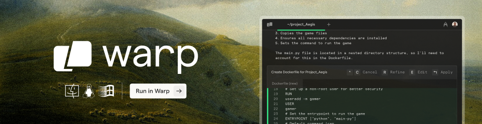

# Perplexica 🔍

[](https://github.com/ItzCrazyKns/Perplexica/stargazers)
[](https://github.com/ItzCrazyKns/Perplexica/network/members)
[](https://github.com/ItzCrazyKns/Perplexica/watchers)
[](https://hub.docker.com/r/itzcrazykns1337/perplexica)
[](https://github.com/ItzCrazyKns/Perplexica/blob/master/LICENSE)
[](https://github.com/ItzCrazyKns/Perplexica/commits/master)
[](https://discord.gg/26aArMy8tT)

Perplexica is a **privacy-focused AI answering engine** that runs entirely on your own hardware. It combines knowledge from the vast internet with support for **local LLMs** (Ollama) and cloud providers (OpenAI, Claude, Groq), delivering accurate answers with **cited sources** while keeping your searches completely private.


Want to know more about its architecture and how it works? You can read it [here](https://github.com/ItzCrazyKns/Perplexica/tree/master/docs/architecture/README.md).

## ✨ Features

🤖 **Support for all major AI providers** - Use local LLMs through Ollama or connect to OpenAI, Anthropic Claude, Google Gemini, Groq, and more. Mix and match models based on your needs.

⚡ **Smart search modes** - Choose Balanced Mode for everyday searches, Fast Mode when you need quick answers, or wait for Quality Mode (coming soon) for deep research.

🎯 **Six specialized focus modes** - Get better results with modes designed for specific tasks: Academic papers, YouTube videos, Reddit discussions, Wolfram Alpha calculations, writing assistance, or general web search.

🔍 **Web search powered by SearxNG** - Access multiple search engines while keeping your identity private. Support for Tavily and Exa coming soon for even better results.

📷 **Image and video search** - Find visual content alongside text results. Search isn't limited to just articles anymore.

📄 **File uploads** - Upload documents and ask questions about them. PDFs, text files, images - Perplexica understands them all.

🌐 **Search specific domains** - Limit your search to specific websites when you know where to look. Perfect for technical documentation or research papers.

💡 **Smart suggestions** - Get intelligent search suggestions as you type, helping you formulate better queries.

📚 **Discover** - Browse interesting articles and trending content throughout the day. Stay informed without even searching.

🕒 **Search history** - Every search is saved locally so you can revisit your discoveries anytime. Your research is never lost.

✨ **More coming soon** - We're actively developing new features based on community feedback. Join our Discord to help shape Perplexica's future!

## Sponsors

Perplexica's development is powered by the generous support of our sponsors. Their contributions help keep this project free, open-source, and accessible to everyone.

<div align="center">
  
  
<a href="https://www.warp.dev/perplexica">
  
</a>

### **✨ [Try Warp - The AI-Powered Terminal →](https://www.warp.dev/perplexica)**

Warp is revolutionizing development workflows with AI-powered features, modern UX, and blazing-fast performance. Used by developers at top companies worldwide.

</div>

---

We'd also like to thank the following partners for their generous support:

<table>
  <tr>
    <td width="100" align="center">
      <a href="https://dashboard.exa.ai" target="_blank">
        
      </a>
    </td>
    <td>
      <a href="https://dashboard.exa.ai">Exa</a> • The Perfect Web Search API for LLMs - web search, crawling, deep research, and answer APIs
    </td>
  </tr>
</table>

## Installation

There are mainly 2 ways of installing Perplexica - With Docker, Without Docker. Using Docker is highly recommended.

### Getting Started with Docker (Recommended)

Perplexica can be easily run using Docker. Simply run the following command:

```bash
docker run -d -p 3000:3000 -v perplexica-data:/home/perplexica/data -v perplexica-uploads:/home/perplexica/uploads --name perplexica itzcrazykns1337/perplexica:latest
```

This will pull and start the Perplexica container with the bundled SearxNG search engine. Once running, open your browser and navigate to http://localhost:3000. You can then configure your settings (API keys, models, etc.) directly in the setup screen.

**Note**: The image includes both Perplexica and SearxNG, so no additional setup is required. The `-v` flags create persistent volumes for your data and uploaded files.

#### Using Perplexica with Your Own SearxNG Instance

If you already have SearxNG running, you can use the slim version of Perplexica:

```bash
docker run -d -p 3000:3000 -e SEARXNG_API_URL=http://your-searxng-url:8080 -v perplexica-data:/home/perplexica/data -v perplexica-uploads:/home/perplexica/uploads --name perplexica itzcrazykns1337/perplexica:slim-latest
```

**Important**: Make sure your SearxNG instance has:

- JSON format enabled in the settings
- Wolfram Alpha search engine enabled

Replace `http://your-searxng-url:8080` with your actual SearxNG URL. Then configure your AI provider settings in the setup screen at http://localhost:3000.

#### Advanced Setup (Building from Source)

If you prefer to build from source or need more control:

1. Ensure Docker is installed and running on your system.
2. Clone the Perplexica repository:

   ```bash
   git clone https://github.com/ItzCrazyKns/Perplexica.git
   ```

3. After cloning, navigate to the directory containing the project files.

4. Build and run using Docker:

   ```bash
   docker build -t perplexica .
   docker run -d -p 3000:3000 -v perplexica-data:/home/perplexica/data -v perplexica-uploads:/home/perplexica/uploads --name perplexica perplexica
   ```

5. Access Perplexica at http://localhost:3000 and configure your settings in the setup screen.

**Note**: After the containers are built, you can start Perplexica directly from Docker without having to open a terminal.

### Non-Docker Installation

1. Install SearXNG and allow `JSON` format in the SearXNG settings. Make sure Wolfram Alpha search engine is also enabled.
2. Clone the repository:

   ```bash
   git clone https://github.com/ItzCrazyKns/Perplexica.git
   cd Perplexica
   ```

3. Install dependencies:

   ```bash
   npm i
   ```

4. Build the application:

   ```bash
   npm run build
   ```

5. Start the application:

   ```bash
   npm run start
   ```

6. Open your browser and navigate to http://localhost:3000 to complete the setup and configure your settings (API keys, models, SearxNG URL, etc.) in the setup screen.

**Note**: Using Docker is recommended as it simplifies the setup process, especially for managing environment variables and dependencies.

See the [installation documentation](https://github.com/ItzCrazyKns/Perplexica/tree/master/docs/installation) for more information like updating, etc.

### Troubleshooting

#### Local OpenAI-API-Compliant Servers

If Perplexica tells you that you haven't configured any chat model providers, ensure that:

1. Your server is running on `0.0.0.0` (not `127.0.0.1`) and on the same port you put in the API URL.
2. You have specified the correct model name loaded by your local LLM server.
3. You have specified the correct API key, or if one is not defined, you have put _something_ in the API key field and not left it empty.

#### Ollama Connection Errors

If you're encountering an Ollama connection error, it is likely due to the backend being unable to connect to Ollama's API. To fix this issue you can:

1. **Check your Ollama API URL:** Ensure that the API URL is correctly set in the settings menu.
2. **Update API URL Based on OS:**

   - **Windows:** Use `http://host.docker.internal:11434`
   - **Mac:** Use `http://host.docker.internal:11434`
   - **Linux:** Use `http://<private_ip_of_host>:11434`

   Adjust the port number if you're using a different one.

3. **Linux Users - Expose Ollama to Network:**

   - Inside `/etc/systemd/system/ollama.service`, you need to add `Environment="OLLAMA_HOST=0.0.0.0:11434"`. (Change the port number if you are using a different one.) Then reload the systemd manager configuration with `systemctl daemon-reload`, and restart Ollama by `systemctl restart ollama`. For more information see [Ollama docs](https://github.com/ollama/ollama/blob/main/docs/faq.md#setting-environment-variables-on-linux)

   - Ensure that the port (default is 11434) is not blocked by your firewall.

#### Lemonade Connection Errors

If you're encountering a Lemonade connection error, it is likely due to the backend being unable to connect to Lemonade's API. To fix this issue you can:

1. **Check your Lemonade API URL:** Ensure that the API URL is correctly set in the settings menu.
2. **Update API URL Based on OS:**

   - **Windows:** Use `http://host.docker.internal:8000`
   - **Mac:** Use `http://host.docker.internal:8000`
   - **Linux:** Use `http://<private_ip_of_host>:8000`

   Adjust the port number if you're using a different one.

3. **Ensure Lemonade Server is Running:**

   - Make sure your Lemonade server is running and accessible on the configured port (default is 8000).
   - Verify that Lemonade is configured to accept connections from all interfaces (`0.0.0.0`), not just localhost (`127.0.0.1`).
   - Ensure that the port (default is 8000) is not blocked by your firewall.

## Using as a Search Engine

If you wish to use Perplexica as an alternative to traditional search engines like Google or Bing, or if you want to add a shortcut for quick access from your browser's search bar, follow these steps:

1. Open your browser's settings.
2. Navigate to the 'Search Engines' section.
3. Add a new site search with the following URL: `http://localhost:3000/?q=%s`. Replace `localhost` with your IP address or domain name, and `3000` with the port number if Perplexica is not hosted locally.
4. Click the add button. Now, you can use Perplexica directly from your browser's search bar.

## Using Perplexica's API

Perplexica also provides an API for developers looking to integrate its powerful search engine into their own applications. You can run searches, use multiple models and get answers to your queries.

For more details, check out the full documentation [here](https://github.com/ItzCrazyKns/Perplexica/tree/master/docs/API/SEARCH.md).

## Expose Perplexica to network

Perplexica runs on Next.js and handles all API requests. It works right away on the same network and stays accessible even with port forwarding.

## One-Click Deployment

[](https://usw.sealos.io/?openapp=system-template%3FtemplateName%3Dperplexica)
[](https://repocloud.io/details/?app_id=267)
[](https://template.run.claw.cloud/?referralCode=U11MRQ8U9RM4&openapp=system-fastdeploy%3FtemplateName%3Dperplexica)
[](https://www.hostinger.com/vps/docker-hosting?compose_url=https://raw.githubusercontent.com/ItzCrazyKns/Perplexica/refs/heads/master/docker-compose.yaml)

## Upcoming Features

- [x] Add settings page
- [x] Adding support for local LLMs
- [x] History Saving features
- [x] Introducing various Focus Modes
- [x] Adding API support
- [x] Adding Discover
- [ ] Finalizing Copilot Mode

## Support Us

If you find Perplexica useful, consider giving us a star on GitHub. This helps more people discover Perplexica and supports the development of new features. Your support is greatly appreciated.

### Donations

We also accept donations to help sustain our project. If you would like to contribute, you can use the following options to donate. Thank you for your support!

| Ethereum                                              |
| ----------------------------------------------------- |
| Address: `0xB025a84b2F269570Eb8D4b05DEdaA41D8525B6DD` |

## Contribution

Perplexica is built on the idea that AI and large language models should be easy for everyone to use. If you find bugs or have ideas, please share them in via GitHub Issues. For more information on contributing to Perplexica you can read the [CONTRIBUTING.md](CONTRIBUTING.md) file to learn more about Perplexica and how you can contribute to it.

## Help and Support

If you have any questions or feedback, please feel free to reach out to us. You can create an issue on GitHub or join our Discord server. There, you can connect with other users, share your experiences and reviews, and receive more personalized help. [Click here](https://discord.gg/EFwsmQDgAu) to join the Discord server. To discuss matters outside of regular support, feel free to contact me on Discord at `itzcrazykns`.

Thank you for exploring Perplexica, the AI-powered search engine designed to enhance your search experience. We are constantly working to improve Perplexica and expand its capabilities. We value your feedback and contributions which help us make Perplexica even better. Don't forget to check back for updates and new features!
