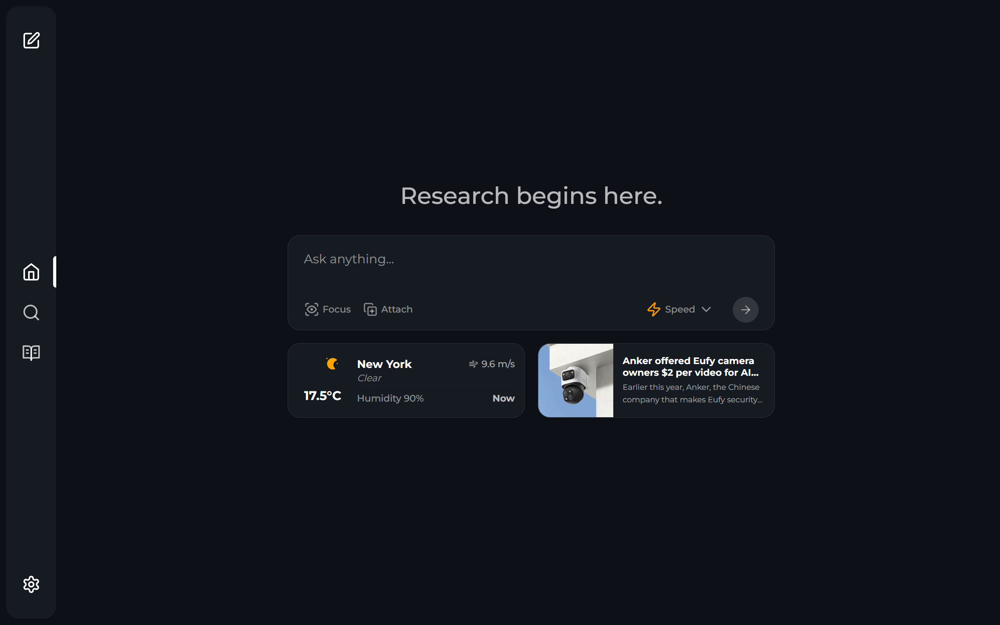

# 🚀 Perplexica - An AI-powered search engine 🔎 <!-- omit in toc -->



## Table of Contents <!-- omit in toc -->

- [Overview](#overview)
- [Preview](#preview)
- [Features](#features)
- [Installation](#installation)
  - [Getting Started with Docker (Recommended)](#getting-started-with-docker-recommended)
  - [Non-Docker Installation](#non-docker-installation)
  - [Ollama connection errors](#ollama-connection-errors)
- [Using as a Search Engine](#using-as-a-search-engine)
- [One-Click Deployment](#one-click-deployment)
- [Upcoming Features](#upcoming-features)
- [Support Us](#support-us)
  - [Donations](#donations)
- [Contribution](#contribution)
- [Help and Support](#help-and-support)

## Overview

Perplexica is an open-source AI-powered searching tool or an AI-powered search engine that goes deep into the internet to find answers. Inspired by Perplexity AI, it's an open-source option that not just searches the web but understands your questions. It uses advanced machine learning algorithms like similarity searching and embeddings to refine results and provides clear answers with sources cited.

Using SearxNG to stay current and fully open source, Perplexica ensures you always get the most up-to-date information without compromising your privacy.

Want to know more about its architecture and how it works? You can read it [here](https://github.com/ItzCrazyKns/Perplexica/tree/master/docs/architecture/README.md).

## Preview


## Features

- **Local LLMs**: You can make use local LLMs such as Llama3 and Mixtral using Ollama.
- **Two Main Modes:**
  - **Copilot Mode:** (In development) Boosts search by generating different queries to find more relevant internet sources. Like normal search instead of just using the context by SearxNG, it visits the top matches and tries to find relevant sources to the user's query directly from the page.
  - **Normal Mode:** Processes your query and performs a web search.
- **Focus Modes:** Special modes to better answer specific types of questions. Perplexica currently has 6 focus modes:
  - **All Mode:** Searches the entire web to find the best results.
  - **Writing Assistant Mode:** Helpful for writing tasks that does not require searching the web.
  - **Academic Search Mode:** Finds articles and papers, ideal for academic research.
  - **YouTube Search Mode:** Finds YouTube videos based on the search query.
  - **Wolfram Alpha Search Mode:** Answers queries that need calculations or data analysis using Wolfram Alpha.
  - **Reddit Search Mode:** Searches Reddit for discussions and opinions related to the query.
- **Current Information:** Some search tools might give you outdated info because they use data from crawling bots and convert them into embeddings and store them in a index. Unlike them, Perplexica uses SearxNG, a metasearch engine to get the results and rerank and get the most relevant source out of it, ensuring you always get the latest information without the overhead of daily data updates.

It has many more features like image and video search. Some of the planned features are mentioned in [upcoming features](#upcoming-features).

## Installation

There are mainly 2 ways of installing Perplexica - With Docker, Without Docker. Using Docker is highly recommended.

### Getting Started with Docker (Recommended)

1. Ensure Docker is installed and running on your system.
2. Clone the Perplexica repository:

   ```bash
   git clone https://github.com/ItzCrazyKns/Perplexica.git
   ```

3. After cloning, navigate to the directory containing the project files.

4. Rename the `sample.config.toml` file to `config.toml`. For Docker setups, you need only fill in the following fields:

   - `OPENAI`: Your OpenAI API key. **You only need to fill this if you wish to use OpenAI's models**.
   - `OLLAMA`: Your Ollama API URL. You should enter it as `http://host.docker.internal:PORT_NUMBER`. If you installed Ollama on port 11434, use `http://host.docker.internal:11434`. For other ports, adjust accordingly. **You need to fill this if you wish to use Ollama's models instead of OpenAI's**.
   - `GROQ`: Your Groq API key. **You only need to fill this if you wish to use Groq's hosted models**

     **Note**: You can change these after starting Perplexica from the settings dialog.

   - `SIMILARITY_MEASURE`: The similarity measure to use (This is filled by default; you can leave it as is if you are unsure about it.)

5. Ensure you are in the directory containing the `docker-compose.yaml` file and execute:

   ```bash
   docker compose up -d
   ```

6. Wait a few minutes for the setup to complete. You can access Perplexica at http://localhost:3000 in your web browser.

**Note**: After the containers are built, you can start Perplexica directly from Docker without having to open a terminal.

### Non-Docker Installation

1. Clone the repository and rename the `sample.config.toml` file to `config.toml` in the root directory. Ensure you complete all required fields in this file.
2. Rename the `.env.example` file to `.env` in the `ui` folder and fill in all necessary fields.
3. After populating the configuration and environment files, run `npm i` in both the `ui` folder and the root directory.
4. Install the dependencies and then execute `npm run build` in both the `ui` folder and the root directory.
5. Finally, start both the frontend and the backend by running `npm run start` in both the `ui` folder and the root directory.

**Note**: Using Docker is recommended as it simplifies the setup process, especially for managing environment variables and dependencies.

See the [installation documentation](https://github.com/ItzCrazyKns/Perplexica/tree/master/docs/installation) for more information like exposing it your network, etc.

### Ollama connection errors

If you're facing an Ollama connection error, it is often related to the backend not being able to connect to Ollama's API. How can you fix it? You can fix it by updating your Ollama API URL in the settings menu to the following:

On Windows: `http://host.docker.internal:11434`<br>
On Mac: `http://host.docker.internal:11434`<br>
On Linux: `http://private_ip_of_computer_hosting_ollama:11434`

You need to edit the ports accordingly.

## Using as a Search Engine

If you wish to use Perplexica as an alternative to traditional search engines like Google or Bing, or if you want to add a shortcut for quick access from your browser's search bar, follow these steps:

1. Open your browser's settings.
2. Navigate to the 'Search Engines' section.
3. Add a new site search with the following URL: `http://localhost:3000/?q=%s`. Replace `localhost` with your IP address or domain name, and `3000` with the port number if Perplexica is not hosted locally.
4. Click the add button. Now, you can use Perplexica directly from your browser's search bar.

## One-Click Deployment

[](https://repocloud.io/details/?app_id=267)

## Deploy Perplexica backend to Google GKE

0: Install `docker` and `terraform` (Process specific to your system)
1a: Copy the `sample.env` file to `.env`
1b: Copy the `deploy/gcp/sample.env` file to `deploy/gcp/.env`
2a: Fillout desired LLM provider access keys etc. in `.env`

- Note: you will have to comeback and edit this file again once you have the address of the K8s backend deploy
  2b: Fillout the GCP info in `deploy/gcp/.env`
  3: Edit `GCP_REPO` to the correct docker image repo path if you are using something other than Container registry
  4: Edit the `PREFIX` if you would like images and GKE entities to be prefixed with something else
  5: In `deploy/gcp` run `make init` to initialize terraform
  6: Follow the normal Preplexica configuration steps outlined in the project readme
  7: Auth docker with the appropriate credential for repo Ex. for `gcr.io` -> `gcloud auth configure-docker`
  8: In `deploy/gcp` run `make build-deplpy` to build and push the project images to the repo, create a GKE cluster and deploy the app
  9: Once deployed successfully edit the `.env` file in the root project folder and update the `REMOTE_BACKEND_ADDRESS` with the remote k8s deployment address and port
  10: In root project folder run `make rebuild-run-app-only`

If you configured everything correctly frontend app will run locally and provide you with a local url to open it.
Now you can run queries against the remotely deployed backend from your local machine. :celebrate:

## Upcoming Features

- [ ] Finalizing Copilot Mode
- [x] Add settings page
- [x] Adding support for local LLMs
- [ ] Adding Discover and History Saving features
- [x] Introducing various Focus Modes

## Support Us

If you find Perplexica useful, consider giving us a star on GitHub. This helps more people discover Perplexica and supports the development of new features. Your support is greatly appreciated.

### Donations

We also accept donations to help sustain our project. If you would like to contribute, you can use the following button to make a donation in cryptocurrency. Thank you for your support!

<a href="https://nowpayments.io/donation?api_key=RFFKJH1-GRR4DQG-HFV1DZP-00G6MMK&source=lk_donation&medium=referral" target="_blank">
  
</a>

## Contribution

Perplexica is built on the idea that AI and large language models should be easy for everyone to use. If you find bugs or have ideas, please share them in via GitHub Issues. For more information on contributing to Perplexica you can read the [CONTRIBUTING.md](CONTRIBUTING.md) file to learn more about Perplexica and how you can contribute to it.

## Help and Support

If you have any questions or feedback, please feel free to reach out to us. You can create an issue on GitHub or join our Discord server. There, you can connect with other users, share your experiences and reviews, and receive more personalized help. [Click here](https://discord.gg/EFwsmQDgAu) to join the Discord server. To discuss matters outside of regular support, feel free to contact me on Discord at `itzcrazykns`.

Thank you for exploring Perplexica, the AI-powered search engine designed to enhance your search experience. We are constantly working to improve Perplexica and expand its capabilities. We value your feedback and contributions which help us make Perplexica even better. Don't forget to check back for updates and new features!
