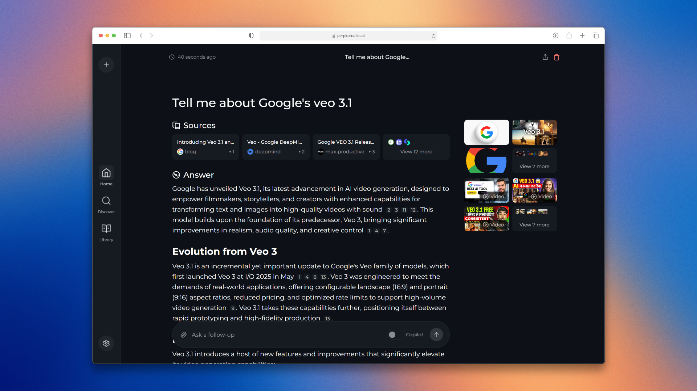

# 🚀 Perplexica - An AI-powered search engine 🔎 <!-- omit in toc -->



## Table of Contents <!-- omit in toc -->

- [Overview](#overview)
- [Preview](#preview)
- [Features](#features)
- [Installation](#installation)
  - [Getting Started with Docker (Recommended)](#getting-started-with-docker-recommended)
  - [Non-Docker Installation](#non-docker-installation)
- [Upcoming Features](#upcoming-features)
- [Support Us](#support-us)
- [Contribution](#contribution)
- [Acknowledgements](#acknowledgements)

## Overview

Perplexica is an open-source AI-powered searching tool or an AI-powered search engine that goes deep into the internet to find answers. Inspired by Perplexity AI, it's an open-source option that not just searches the web but understands your questions. It uses advanced machine learning algorithms like similarity searching and embeddings to refine results and provides clear answers with sources cited.

## Preview


## Features

- **Two Main Modes:**
  - **Copilot Mode:** (In development) Boosts search by generating different queries to find more relevant internet sources. Like normal search instead of just using the context by SearxNG, it visits the top matches and tries to find relevant sources to the user's query directly from the page.
  - **Normal Mode:** Processes your query and performs a web search.
- **Focus Modes:** Special modes to better answer specific types of questions. Perplexica currently has 6 focus modes:

  1. **All Mode:** Searches the entire web to find the best results.
  2. **Writing Assistant Mode:** Helpful for writing tasks that does not require searching the web.
  3. **Academic Search Mode:** Finds articles and papers, ideal for academic research.
  4. **YouTube Search Mode:** Finds YouTube videos based on the search query.
  5. **Wolfram Alpha Search Mode:** Answers queries that need calculations or data analysis using Wolfram Alpha.
  6. **Reddit Search Mode:** Searches Reddit for discussions and opinions related to the query.

- **Current Information:** Some search tools might give you outdated info because they use data from crawling bots and convert them into embeddings and store them in a index (its like converting the web into embeddings which is quite expensive.). Unlike them, Perplexica uses SearxNG, a metasearch engine to get the results and rerank and get the most relevent source out of it, ensuring you always get the latest information without the overhead of daily data updates.

It has many more features like image and video search. Some of the planned features are mentioned in [upcoming features](#upcoming-features).

## Installation

There are mainly 2 ways of installing Perplexica - With Docker, Without Docker. Using Docker is highly recommended.

### Getting Started with Docker (Recommended)

1. Ensure Docker is installed and running on your system.
2. Clone the Perplexica repository:

   ```bash
   git clone https://github.com/ItzCrazyKns/Perplexica.git
   ```

3. After cloning, navigate to the directory containing the project files.

4. Rename the `.env.example` file to `.env`. For Docker setups, you need only fill in the following fields:

   - `OPENAI_API_KEY`
   - `SIMILARITY_MEASURE` (This is filled by default; you can leave it as is if you are unsure about it.)

5. Ensure you are in the directory containing the `docker-compose.yaml` file and execute:

   ```bash
   docker compose up
   ```

6. Wait a few minutes for the setup to complete. You can access Perplexica at http://localhost:3000 in your web browser.

**Note**: Once the terminal is stopped, Perplexica will also stop. To restart it, you will need to open Docker Desktop and run Perplexica again.

### Non-Docker Installation

For setups without Docker:

1. Follow the initial steps to clone the repository and rename the `.env.example` file to `.env` in the root directory. You will need to fill in all the fields in this file.
2. Additionally, rename the `.env.example` file to `.env` in the `ui` folder and complete all fields.
3. The non-Docker setup requires manual configuration of both the backend and frontend.

**Note**: Using Docker is recommended as it simplifies the setup process, especially for managing environment variables and dependencies.

## Upcoming Features

- [ ] Finalizing Copilot Mode
- [ ] Adding support for multiple local LLMs and LLM providers such as Anthropic, Google, etc.
- [ ] Adding Discover and History Saving features
- [x] Introducing various Focus Modes

## Support Us

If you find Perplexica useful, consider giving us a star on GitHub. This helps more people discover Perplexica and supports the development of new features. Your support is appreciated.

## Contribution

Perplexica is built on the idea that AI and large language models should be easy for everyone to use. If you find bugs or have ideas, please share them in via GitHub Issues. Details on how to contribute will be shared soon.

## Acknowledgements

Inspired by Perplexity AI, Perplexica aims to provide a similar service but always up-to-date and fully open source, thanks to SearxNG.

If you have any queries you can reach me via my Discord - `itzcrazykns`. Thanks for checking out Perplexica.
