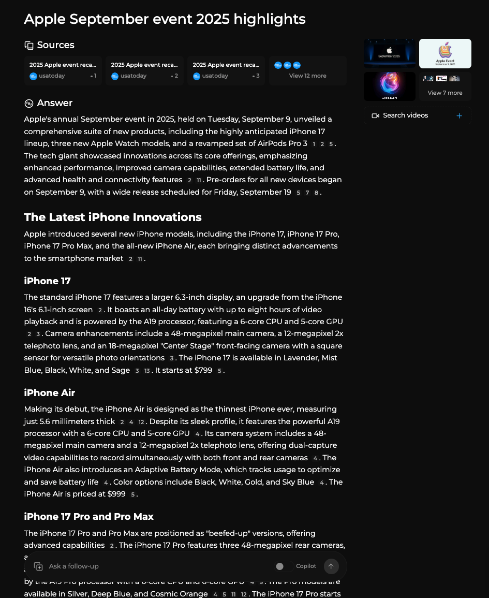

# Firecrawl: Before vs. After in Perplexica

This document presents photo‑verified before/after evidence of what enabling Firecrawl changes inside the app. It explains how the feature is wired in the code, what improvements it brings to answers, and the trade‑offs you should expect (notably latency).

The screenshots referenced below live alongside this file under `docs/firecrawl/*.png`.

## What Firecrawl Does

- Enriches search results with fresh, page‑level content by scraping top URLs returned by SearXNG.
- Converts raw pages into concise, model‑friendly markdown plus extracted links and metadata.
- Falls back to the original links when scraping returns no data.

Code flow (key files):

- `src/components/FirecrawlToggle.tsx` — user toggle; persists `useFirecrawl` in `localStorage`.
- `src/lib/hooks/useChat.tsx` — includes `useFirecrawl` in the request body to server routes.
- `src/app/api/chat/route.ts` and `src/app/api/search/route.ts` — propagate the flag to the agent, log status.
- `src/lib/search/metaSearchAgent.ts` — enriches SearXNG URLs when `useFirecrawl` is true.
- `src/lib/utils/documents.ts` — pulls documents for each link; tries Firecrawl first, then falls back.
- `src/lib/firecrawl.ts` — thin client around `@mendable/firecrawl-js`.

Environment requirement: set `FIRECRAWL_API_KEY` in `.env.local` (and keep it secret).

---

## Evidence 1 — General News Query

Query: “Apple September event 2025 highlights”

### Before: Firecrawl OFF

Observations:

- Narrative is generic with limited specifics on products and dates.
- Fewer sectioned breakdowns; details like feature lists are sparse.
- Citations exist but are not grounded in deep page context.

Associated logs (excerpt):

- Server prints: `useFirecrawl flag: false env: true` — API key is present, but enrichment is disabled.
- No scraping lines; only normal request/response timings.

### After: Firecrawl ON

Improvements:

- Structured sections with concrete facts the model could only know by reading pages:
  - “Next‑Generation iPhone Lineup”, “iPhone 17 Series”, “Introducing the iPhone Air” (with the $999 price), and “AirPods Pro 3 with Advanced Features” (live translation feature), plus Apple Watch updates.
- More precise event timing and preorder dates pulled from first‑party sources and newsrooms.
- Clearer grounding; references align with the sections summarized.

How we know the enrichment happened:

- Server prints: `useFirecrawl flag: true env: true` and `enriching SearXNG URLs with Firecrawl`.
- Scraping attempts across Apple newsroom, Fortune, TechRadar, Wikipedia, etc., with visible “no data, falling back …” lines when a page blocks or returns empty — exactly matching the fallback behavior in `src/lib/utils/documents.ts`.

Latency trade‑off (from screenshots):

- OFF: `POST /api/chat 200 in 23023ms` (~23.0s)
- ON: `POST /api/chat 200 in 38578ms` (~38.6s)

Interpretation: enabling Firecrawl increases response time (first run) due to live crawling, but yields a significantly richer, better‑structured answer.

---

## Evidence 2 — Personal Content Discovery

Query: “tell me about his blogs”

### Before: Firecrawl OFF

Observations:

- The system claims that “there is no specific information available about blogs,” despite links that exist elsewhere on the web.
- Reason: the agent is working only with shallow snippets from generic search results; no page‑level extraction occurs.

### After: Firecrawl ON

Improvements:

- Detects and summarizes the actual blog presence, pulling concrete titles, dates, and summaries of two featured pieces:
  - “Open Banking System Design and Architecture” (Oct 2024; 7‑minute read; Africa’s banking industry focus).
  - “X‑Ray Image Detection for Medical Implants” (July 2022; early research; 2‑minute read).
- Provides a correct, source‑anchored narrative about the author’s writing themes and invites deeper exploration.

Why this happens:

- With Firecrawl, the agent fetches the personal website/blog pages themselves, converts them to markdown, and feeds that content back into the retriever chain. This overcomes thin/ambiguous snippets from vanilla search.

---

## What Changes in the Model’s Inputs

With Firecrawl ON, each top URL can contribute:

- Cleaned markdown (main body content, stripped of nav/ads where possible).
- Extracted links plus metadata that help the retriever rerank evidence.
- A reliable fallback path when scraping fails or is blocked — we still keep and cite the raw link.

This yields:

- Higher recall — more relevant facts make it into the context window.
- Higher precision — less noise than raw HTML or unparsed snippets.
- Better sectioning — summaries naturally form around page‑level topics.

Trade‑off:

- Additional latency and outbound requests. On cold runs, answers can be 1.3–1.8× slower. Caching and selective use mitigate this.

---

## Operational Guidance

- When to enable:
  - Use for queries that ask for fresh news, deep product details, or personal content (blogs, portfolios) where surface snippets are unreliable.
  - Disable for simple lookups where search snippets suffice to reduce latency.

- Configuration:
  - Set `FIRECRAWL_API_KEY` in `.env.local`.
  - Use the UI toggle (“Use Firecrawl”) which stores `localStorage.useFirecrawl` and flows to API routes.

- Tuning ideas (future):
  - Add per‑query heuristics: only enable on low‑confidence retrieval or when top results come from social/news.
  - Cache markdown by URL and `ETag`/`Last‑Modified` to amortize costs.
  - Domain allow/deny lists to avoid slow or blocker‑heavy sites.
  - Cap depth/concurrency for stability under load.

---

## Summary

Enabling Firecrawl demonstrably improves answer quality in Perplexica:

- Richer facts and clearer structure for complex news queries.
- Accurate discovery and summarization of personal blogs and publications.
- Transparent, debuggable behavior via logs, with reliable fallbacks.

Expect a modest latency increase, especially on cold runs. For research‑grade answers or ambiguous queries, the quality gains strongly justify enabling Firecrawl.
